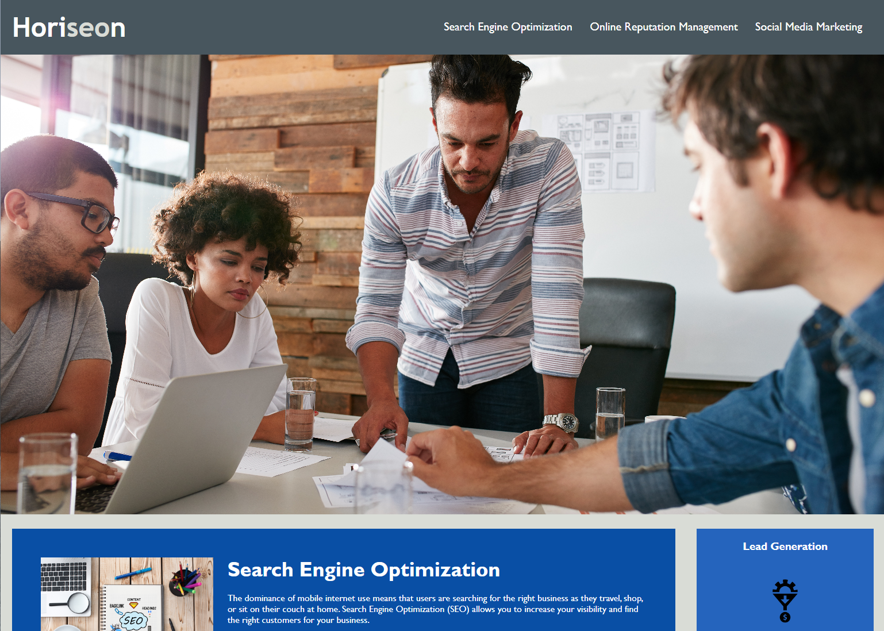
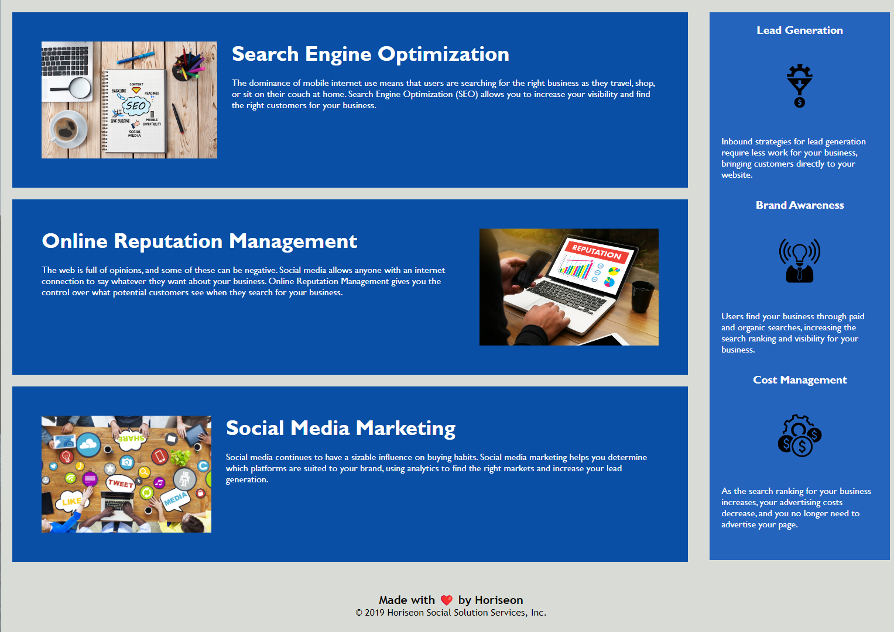

# Horiseon Code Refactor

## Description

The goal of this project was to refactor existing codebase to meet accessibility standards so that website is optimized for search engines.

To achieve that following steps were taken:

- Source code was updated to have semantic HTML elements.
- Structures of HTML and CSS files were modified so that the elements follow a logical structure.
- Added accessible alt attributes to image elements.
- Updated heading attributes to fall in sequential order.
- Updated title element to a descriptive title.
- Updated color scheme to improve accessibility. 

As a result, website now is more accessible and optimized for search engine. 

## Usage

Webpage is located at: https://vlada-caban.github.io/horiseon-code-refactor/

Use menu at the top to navigate to each section.

Example if navigated to "Search Engine Optimization":

## License

Please refer to the LICENSE in the repo.

